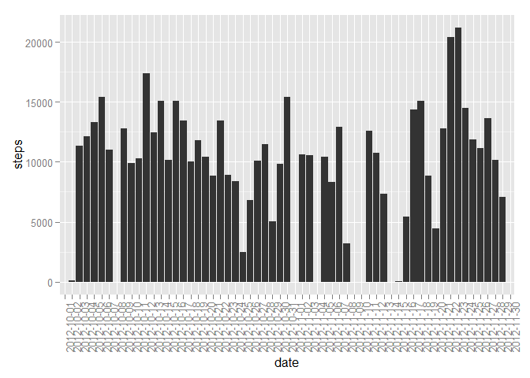
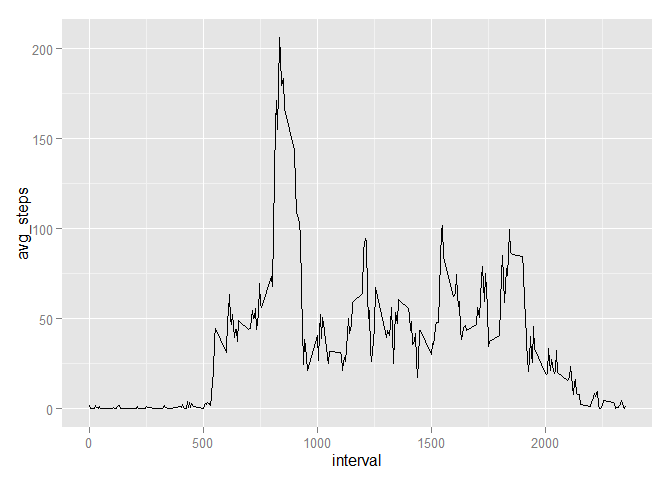
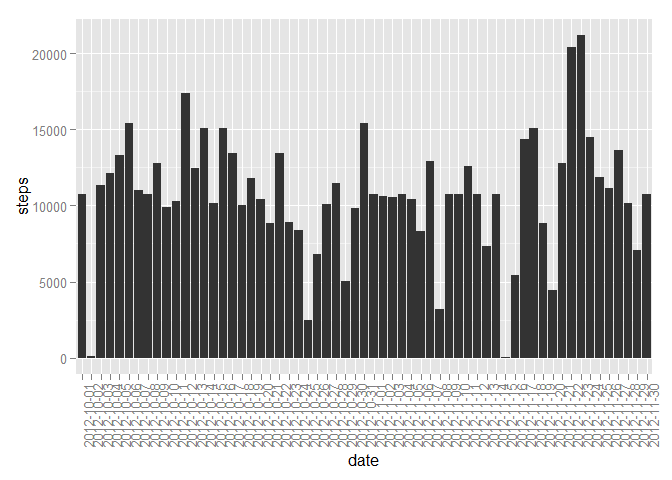
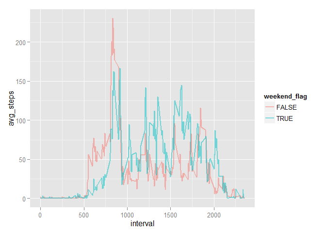

# Reproducible Research: Peer Assessment 1


## Loading and preprocessing the data

```r
library(sqldf)
```

```
## Loading required package: gsubfn
## Loading required package: proto
## Loading required package: RSQLite
## Loading required package: DBI
```

```r
library(ggplot2)
library(Hmisc)
```

```
## Warning: package 'Hmisc' was built under R version 3.1.3
```

```
## Loading required package: grid
## Loading required package: lattice
## Loading required package: survival
## Loading required package: splines
## Loading required package: Formula
## 
## Attaching package: 'Hmisc'
## 
## The following objects are masked from 'package:base':
## 
##     format.pval, round.POSIXt, trunc.POSIXt, units
```

```r
library(rmarkdown)
```

```
## Warning: package 'rmarkdown' was built under R version 3.1.3
```

```r
setwd("C:/Users/rcoleman/Documents/GitHub/Coursera/Reproducible-Research/RepData_PeerAssessment1")

df <- read.csv("activity.csv")

head(df)
```

```
##   steps       date interval
## 1    NA 2012-10-01        0
## 2    NA 2012-10-01        5
## 3    NA 2012-10-01       10
## 4    NA 2012-10-01       15
## 5    NA 2012-10-01       20
## 6    NA 2012-10-01       25
```
## What is mean total number of steps taken per day?
### Transform the Data

```r
dfTemp <- sqldf("
select date
  ,sum(steps) as total_steps
from df
group by 1
")
```

```
## Loading required package: tcltk
```

```r
head(dfTemp)
```

```
##         date total_steps
## 1 2012-10-01        <NA>
## 2 2012-10-02         126
## 3 2012-10-03       11352
## 4 2012-10-04       12116
## 5 2012-10-05       13294
## 6 2012-10-06       15420
```
### Histogram of Total Number of Steps by Day

```
## Warning: Removed 2304 rows containing missing values (position_stack).
```

 
### Mean and Median

```r
dfAggregate <- sqldf("
select avg(total_steps) as mean_steps
  ,median(total_steps) as median_steps
from dfTemp")

dfAggregate
```

```
##   mean_steps median_steps
## 1   10766.19        10765
```
## What is the average daily activity pattern?
### Transform the Data

```r
dfTemp <- sqldf("
select interval
  ,avg(steps) as avg_steps
from df
group by 1")

index <- which.max(dfTemp$avg_steps)

head(dfTemp)
```

```
##   interval avg_steps
## 1        0 1.7169811
## 2        5 0.3396226
## 3       10 0.1320755
## 4       15 0.1509434
## 5       20 0.0754717
## 6       25 2.0943396
```
### Interval with Maximum Value

```r
dfTemp[104,]
```

```
##     interval avg_steps
## 104      835  206.1698
```
### Time Series Plot of Average Steps by Interval
 
## Imputing missing values
Lets first get some summary statistics on our dataframe to doublecheck our work.

```r
summary(df)
```

```
##      steps                date          interval     
##  Min.   :  0.00   2012-10-01:  288   Min.   :   0.0  
##  1st Qu.:  0.00   2012-10-02:  288   1st Qu.: 588.8  
##  Median :  0.00   2012-10-03:  288   Median :1177.5  
##  Mean   : 37.38   2012-10-04:  288   Mean   :1177.5  
##  3rd Qu.: 12.00   2012-10-05:  288   3rd Qu.:1766.2  
##  Max.   :806.00   2012-10-06:  288   Max.   :2355.0  
##  NA's   :2304     (Other)   :15840
```

```r
describe(df)
```

```
## df 
## 
##  3  Variables      17568  Observations
## ---------------------------------------------------------------------------
## steps 
##       n missing  unique    Info    Mean     .05     .10     .25     .50 
##   15264    2304     617    0.62   37.38     0.0     0.0     0.0     0.0 
##     .75     .90     .95 
##    12.0    86.0   252.8 
## 
## lowest :   0   1   2   3   4, highest: 786 789 794 802 806 
## ---------------------------------------------------------------------------
## date 
##       n missing  unique 
##   17568       0      61 
## 
## lowest : 2012-10-01 2012-10-02 2012-10-03 2012-10-04 2012-10-05
## highest: 2012-11-26 2012-11-27 2012-11-28 2012-11-29 2012-11-30 
## ---------------------------------------------------------------------------
## interval 
##       n missing  unique    Info    Mean     .05     .10     .25     .50 
##   17568       0     288       1    1178   110.0   220.0   588.8  1177.5 
##     .75     .90     .95 
##  1766.2  2135.0  2245.0 
## 
## lowest :    0    5   10   15   20, highest: 2335 2340 2345 2350 2355 
## ---------------------------------------------------------------------------
```
We can see that there are 2304 missing values in the summary statistics. Lets double check this number through our own computation

```r
dfMissing <- sqldf("
select count(*)
from df
where steps is null")

dfMissing
```

```
##   count(*)
## 1     2304
```
### Fill in the missing values
Now that we know the magnitude of missing values in our dataset we can construct a method to fill in these missing values. I chose to fill in the null values with the mean value for that interval
#### Mean Steps by Interval

```r
dfIntervalMean <- sqldf("
select interval
  ,avg(steps) as avg_steps
from df
group by 1")

head(dfIntervalMean)
```

```
##   interval avg_steps
## 1        0 1.7169811
## 2        5 0.3396226
## 3       10 0.1320755
## 4       15 0.1509434
## 5       20 0.0754717
## 6       25 2.0943396
```
Now that we have the mean steps by interval we can go about filling in the missing values. I have chosen to loop through each row in the dataframe but this can be vectorized for an improvement in speed.

```r
dfTemp <- df

for(i in 1:nrow(dfTemp)) {
  for (j in 1:nrow(dfIntervalMean)) {
    if(is.na(dfTemp$steps[i]) & dfTemp$interval[i] == dfIntervalMean$interval[j]) {
      dfTemp$steps[i] <- dfIntervalMean$avg_steps[j]
    }
  }
}

dfFilledNa <- dfTemp
```
### Histogram with NA's Filled
Now that we have the missing values filled in lets take a look at our new histogram of steps by day to see if they differ from our original dataset.

```r
ggplot(data=dfFilledNa,aes(x=date,y=steps)) +
  geom_histogram(stat="identity") +
  theme(axis.text.x = element_text(angle = 90, hjust = 1))
```

 
### Mean/Median of filled in values
Lets take a look at the average and median steps per day of our new dataset to see if they differ from the original dataset. First we get the total number of steps by day.

```r
dfTemp <- sqldf("
select date
  ,sum(steps) as total_steps
from dfFilledNa
group by 1
")

head(dfTemp)
```

```
##         date total_steps
## 1 2012-10-01    10766.19
## 2 2012-10-02      126.00
## 3 2012-10-03    11352.00
## 4 2012-10-04    12116.00
## 5 2012-10-05    13294.00
## 6 2012-10-06    15420.00
```
Now that we have the total number of steps by day we can take the mean/median.

```r
dfAggregateFixed <- sqldf("
select avg(total_steps) as mean_steps
  ,median(total_steps) as median_steps
from dfTemp")

head(dfAggregateFixed)
```

```
##   mean_steps median_steps
## 1   10766.19     10766.19
```
We can see the mean and median do not change from the original dataset by any large amount. It is important to note that the variance of the original dtaset will be reduced with more values now corresponding to the average of an interval.
## Are there differences in activity patterns between weekdays and weekends?
### Construct a way to differentiate Weekends from Weekdays
We first must convert our date column into a POSIXct date type. We are then able to call the weekdays function on this new column, which can then be used to determine weekends vs weeldays.

```r
dfFilledNa$date_fixed <- as.POSIXct(dfFilledNa$date)

dfFilledNa$weekday <- weekdays(dfFilledNa$date_fixed)

dfFilledNa$weekend_flag <- dfFilledNa$weekday %in% c('Saturday','Sunday')

head(dfFilledNa)
```

```
##       steps       date interval date_fixed weekday weekend_flag
## 1 1.7169811 2012-10-01        0 2012-10-01  Monday        FALSE
## 2 0.3396226 2012-10-01        5 2012-10-01  Monday        FALSE
## 3 0.1320755 2012-10-01       10 2012-10-01  Monday        FALSE
## 4 0.1509434 2012-10-01       15 2012-10-01  Monday        FALSE
## 5 0.0754717 2012-10-01       20 2012-10-01  Monday        FALSE
## 6 2.0943396 2012-10-01       25 2012-10-01  Monday        FALSE
```
### Aggregate by weekend vs weekday
Now that we have data seperated by weekday, we can aggregate theto get the average number of steps by interval/weekend_flag.

```r
dfTemp <- sqldf("
select weekend_flag
  ,interval
  ,avg(steps) as avg_steps
from dfFilledNa
group by 1,2
")

head(dfTemp)
```

```
##   weekend_flag interval  avg_steps
## 1        FALSE        0 2.25115304
## 2        FALSE        5 0.44528302
## 3        FALSE       10 0.17316562
## 4        FALSE       15 0.19790356
## 5        FALSE       20 0.09895178
## 6        FALSE       25 1.59035639
```

### Time series plot of weekends vs weekdays for averege steps in an interval

```r
ggplot(data=dfTemp,aes(x=interval,y=avg_steps,color=weekend_flag)) +
  geom_line(size=1,alpha=.5)
```

 
